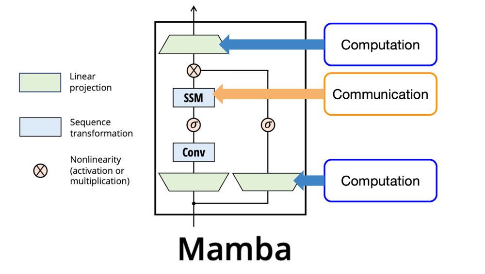

# Integrating Mamba-SSM and BitNet with Avian-Inspired Cognition: An Implementation Roadmap

## System Overview

**Architecture Summary:** We propose an AI system that combines the **Mamba** state-space model (SSM) architecture with **BitNet** 1-bit quantization, enhanced by cognitive modules inspired by avian intelligence. The core is a Mamba-based sequence model providing efficient long-sequence processing via selective state dynamics, onto which we graft four specialized modules: (1) a **Metacognition module** for self-evaluation and confidence estimation, (2) a **Bayesian inference module** for probabilistic reasoning, (3) a **Planning/Tool-Use module** for multi-step reasoning and tool interaction, and (4) a **Numerical competence module** for arithmetic and counting skills. The entire model is quantized with BitNet techniques (binary weight matrices) to drastically reduce memory and computation requirements.

**Mamba SSM Backbone:** Mamba is a recent linear-time sequence model that replaces attention with a learned state-space process ([[2312.00752] Mamba: Linear-Time Sequence Modeling with Selective State Spaces](https://arxiv.org/abs/2312.00752#:~:text=such%20models%20is%20their%20inability,times%24%20higher%20throughput%20than)). Instead of attending to all past tokens, Mamba maintains a latent state that **selectively propagates or forgets information** based on the current input ([[2312.00752] Mamba: Linear-Time Sequence Modeling with Selective State Spaces](https://arxiv.org/abs/2312.00752#:~:text=such%20models%20is%20their%20inability,times%24%20higher%20throughput%20than)). This “selective SSM” mechanism allows content-based gating of long-range information, addressing the weakness of earlier SSMs on discrete data like language ([[2312.00752] Mamba: Linear-Time Sequence Modeling with Selective State Spaces](https://arxiv.org/abs/2312.00752#:~:text=such%20models%20is%20their%20inability,times%24%20higher%20throughput%20than)). The Mamba block (analogous to a Transformer block) uses a **control-theoretic SSM for token communication** and simple linear/conv layers for per-token computation ([Mamba Explained](https://thegradient.pub/mamba-explained/#:~:text=We%20would%20like%20to%20substitute,style%20projections%20for%20Computation)). **Figure 1** illustrates the Mamba block structure: an SSM handles sequence transformation (long-range dependencies) while feed-forward layers (linear projections and local conv) handle local computation ([Mamba Explained](https://thegradient.pub/mamba-explained/#:~:text=We%20would%20like%20to%20substitute,style%20projections%20for%20Computation)). This design yields **linear-time complexity** in sequence length and high throughput (5× faster inference than Transformers) ([[2312.00752] Mamba: Linear-Time Sequence Modeling with Selective State Spaces](https://arxiv.org/abs/2312.00752#:~:text=dimension%20depending%20on%20the%20current,As%20a%20general%20sequence)) without sacrificing performance. In fact, a 3B-parameter Mamba model can match or exceed Transformer performance at the same scale ([[2312.00752] Mamba: Linear-Time Sequence Modeling with Selective State Spaces](https://arxiv.org/abs/2312.00752#:~:text=improves%20on%20real%20data%20up,in%20pretraining%20and%20downstream%20evaluation)).



 ([Mamba Explained](https://thegradient.pub/mamba-explained/)) *Figure 1: The Mamba block uses a Structured State-Space Model (SSM) for sequence communication (orange) and linear/conv layers for computation (blue) ([Mamba Explained](https://thegradient.pub/mamba-explained/#:~:text=We%20would%20like%20to%20substitute,style%20projections%20for%20Computation)). This replaces attention with a recurrent state update, enabling linear time complexity.* 

**BitNet Quantization:** To make this architecture feasible on minimal hardware, we apply **BitNet’s 1-bit weight quantization** throughout the model. BitNet introduces **BitLinear layers** as drop-in replacements for dense layers (e.g. PyTorch `nn.Linear`) that train binary (+1/−1) weights from scratch ([[2310.11453] BitNet: Scaling 1-bit Transformers for Large Language Models](https://arxiv.org/abs/2310.11453#:~:text=deployment%20and%20raised%20concerns%20about,precision%20Transformers)). By quantizing all large weight matrices to 1-bit, BitNet dramatically reduces memory and energy usage. For example, a BitNet model with ~2B parameters can run in ~0.4 GB of memory (versus several GB for 8-bit or FP16 models) ([Microsoft’s “1‑bit” AI model runs on a CPU only, while matching larger systems - Your Source for B2B Tech Trends](https://b2btechhub.sbs/microsofts-1%E2%80%91bit-ai-model-runs-on-a-cpu-only-while-matching-larger-systems/#:~:text=Memory%20requirements%20are%20the%20most,roughly%20the%20same%20parameter%20size)), and uses ~85–96% less energy than full-precision networks in inference tests ([Microsoft’s “1‑bit” AI model runs on a CPU only, while matching larger systems - Your Source for B2B Tech Trends](https://b2btechhub.sbs/microsofts-1%E2%80%91bit-ai-model-runs-on-a-cpu-only-while-matching-larger-systems/#:~:text=But%20the%20simplified%20weighting%20system,precision%20models%2C%20the%20researchers%20estimate)). Crucially, BitNet’s accuracy remains on par with standard models; it achieves competitive language modeling performance to 8-bit and FP16 baselines, even maintaining similar scaling laws ([[2310.11453] BitNet: Scaling 1-bit Transformers for Large Language Models](https://arxiv.org/abs/2310.11453#:~:text=Transformer%20architecture%20designed%20for%20large,maintaining%20efficiency%20and%20performance%20benefits)) ([Microsoft’s “1‑bit” AI model runs on a CPU only, while matching larger systems - Your Source for B2B Tech Trends](https://b2btechhub.sbs/microsofts-1%E2%80%91bit-ai-model-runs-on-a-cpu-only-while-matching-larger-systems/#:~:text=Crucially%2C%20the%20researchers%20say%20these,%E2%80%9D)). This means we can integrate large cognitive-enhanced models and still deploy on commodity hardware. In our architecture, **all major linear transformations** (within Mamba blocks and within cognitive modules) will use BitLinear layers. The resulting “Mamba-BitNet” backbone is both high-throughput and extremely memory-efficient, enabling experimentation without access to giant GPU clusters.

**Avian-Inspired Cognitive Modules:** Birds such as corvids and parrots have demonstrated remarkable cognitive skills – rivaling primates in some cases ([
            Cognitive ornithology: the evolution of avian intelligence - PMC
        ](https://pmc.ncbi.nlm.nih.gov/articles/PMC1626540/#:~:text=supposedly%20unique%20aspects%20of%20human,neural%20connectivity%20patterns%20is%20discussed)) – despite having very different brain structures. Inspired by these, we incorporate four key cognitive functions as modular components in the architecture:

- **Metacognition Module:** provides the model with a form of “self-reflection” – monitoring its own uncertainty or correctness. In animals, metacognition is the ability to gauge confidence in one’s knowledge or decisions ([
            Formal models in animal-metacognition research: the problem of interpreting animals’ behavior - PMC
        ](https://pmc.ncbi.nlm.nih.gov/articles/PMC4909597/#:~:text=Ongoing%20research%20explores%20whether%20animals,attempts%20misunderstand%20the%20content%20and)) ([On Calibration of Modern Neural Networks](https://arxiv.org/pdf/1706.04599#:~:text=In%20real,th%20International%20Conference%20on%20Machine)). In our AI system, this module will produce calibrated confidence estimates alongside answers, enabling the model to know when it *might be wrong*. It draws on the Mamba hidden state to predict a probability or score indicating confidence. This helps the model decide whether to answer or defer (analogous to birds opting out when unsure).

- **Bayesian Inference Module:** allows the model to perform probabilistic reasoning by updating beliefs with new evidence (a hallmark of reasoning under uncertainty). Birds are thought to integrate information over time in a Bayesian-like manner for tasks like foraging in changing environments ([[2210.12294] Bayesian inference is facilitated by modular neural networks with different time scales](https://arxiv.org/abs/2210.12294#:~:text=,neural%20network%20consisting%20of%20a)) ([[2210.12294] Bayesian inference is facilitated by modular neural networks with different time scales](https://arxiv.org/abs/2210.12294#:~:text=only%20with%20the%20main%20module,selectively%20represented%20in%20the%20slower)). Our module maintains a **running latent belief state** that gets updated as new inputs arrive (e.g., evidence in a story or problem). It uses Bayesian update logic (approximately implemented via neural means) to refine probability distributions. This module interacts with Mamba’s state dynamics, effectively acting as a *slow-timescale* component that accumulates information and provides prior context to the main model ([[2210.12294] Bayesian inference is facilitated by modular neural networks with different time scales](https://arxiv.org/abs/2210.12294#:~:text=accurate%20Bayesian%20inferences,the%20time%20scales%20of%20neurons)).

- **Planning / Tool-Use Module:** endows the system with the ability to reason about multi-step tasks and utilize tools or external operations. Certain birds (like crows) can plan several moves ahead or use tools to achieve goals, reflecting an ability to mentally simulate sequences of actions. We implement this via a module that can generate and evaluate intermediate plans. Concretely, the model can produce an internal **chain-of-thought** representation (a series of intermediate reasoning steps or planned actions) which the planning module verifies or adjusts before the final answer. This may involve a small sub-network that iteratively simulates outcomes or calls “virtual tools” (e.g. a calculator, a knowledge lookup) and feeds the results back into the main Mamba sequence. The design is inspired by recent agent frameworks that **break tasks into subunits and invoke tools** for complex reasoning ([OctoTools: Stanford's open-source framework optimizes LLM reasoning through modular tool orchestration | VentureBeat](https://venturebeat.com/ai/octotools-stanfords-open-source-framework-optimizes-llm-reasoning-through-modular-tool-orchestration/#:~:text=OctoTools%2C%20a%20new%20open,their%20own%20tools%20and%20workflows)), but here the planning happens inside the model as a differentiable component. The module interfaces with Mamba by taking an encoding of the task from the Mamba state, expanding it into a tentative plan (e.g. a sequence of actions or reasoning steps), then influencing the Mamba state or outputs based on this plan (through attention-like cross-connections or gated injections into the SSM state).

- **Numerical Competence Module:** gives the model a robust ability to handle numbers and arithmetic, beyond what standard language models learn from data. Many birds show basic numerical cognition (e.g., distinguishing quantities or “counting” small numbers), and Alex the parrot famously demonstrated arithmetic-like abilities. In neural terms, standard architectures often struggle to extrapolate arithmetic beyond training range ([[1808.00508] Neural Arithmetic Logic Units](https://arxiv.org/abs/1808.00508#:~:text=,code%2C%20and%20count%20objects%20in)). To address this, we integrate a specialized neural arithmetic unit that can perform operations like addition, counting, or comparison exactly. We draw on the concept of a **Neural Arithmetic Logic Unit (NALU)** ([[1808.00508] Neural Arithmetic Logic Units](https://arxiv.org/abs/1808.00508#:~:text=values%20encountered%20during%20training,conventional%20architectures%2C%20we%20obtain%20substantially)) – a module that represents numbers in a flexible way and applies learned addition/multiplication operators with nearly perfect generalization. Experiments have shown that NALU-enhanced networks can perform tasks like counting objects and executing code with **orders-of-magnitude better numerical extrapolation** than ordinary networks ([[1808.00508] Neural Arithmetic Logic Units](https://arxiv.org/abs/1808.00508#:~:text=logic%20unit%20,magnitude%20beyond%20trained%20numerical%20ranges)). Our numerical module will similarly introduce learned arithmetic operations (potentially with constrained weight matrices or gating that enforce near-linear behavior for numbers). This module can be invoked when the input or task involves quantitative reasoning (detected either via a special token or by learned routing in the model). During forward passes, the Mamba core can route number-containing tokens or calculation requests into the numeric unit, which returns a precise result (or an embedding thereof) back into the sequence stream.

**Integrated System Flow:** At a high level, the system works as follows: an input (e.g. a question or sequence) is processed by the Mamba backbone through sequential hidden states. The Bayesian module continuously updates a latent belief state in parallel, informing the main state about prior context. When encountering numerical information, the numeric module may be triggered to compute results which are inserted into the state (improving accuracy on math sub-problems). After processing the sequence, the planning module may engage to simulate a multi-step solution (for example, if asked a complex question, it generates an internal plan or reasoning chain). Finally, the Mamba backbone produces an output answer/token sequence. The metacognition module then outputs a confidence score or uncertainty estimate for that answer. All components use BitNet quantized weights, so these computations remain efficient. The architecture is **modular** but end-to-end trainable – each module’s outputs feed into the others in a coordinated way, similar to how different brain regions cooperate. The next sections detail each module’s design and how to implement and integrate them, followed by a phased plan to build, train, and evaluate the entire system.

## Module Design & Integration

Each cognitive module is implemented as a differentiable subnetwork that plugs into the Mamba backbone at specific points. The integration strategy is to **embed each module within Mamba’s selective state-space dynamics** such that the module can influence or read from the recurrent state as needed, without breaking the linear-time paradigm. We describe each module’s design and how BitNet quantization is applied.

### Metacognition Module (Uncertainty Head)

**Design:** The metacognition module is essentially a **confidence head** attached to the model’s output. During training, it learns to predict the probability that the model’s answer is correct (or the model’s degree of certainty in its current state). A simple implementation is a small neural network that takes the final hidden state (or logits) as input and produces a scalar confidence score. For example, we can append a one-layer MLP or even a single linear unit (with sigmoid activation) on top of the final token’s representation. This unit is trained with a calibration objective: e.g. minimizing the difference between its predicted confidence and the actual accuracy outcomes ([On Calibration of Modern Neural Networks](https://arxiv.org/pdf/1706.04599#:~:text=Confidence%20calibration%20%E2%80%93%20the%20problem,evaluate%20the%20performance%20of%20various)). Over time, it learns to produce well-calibrated probabilities ([On Calibration of Modern Neural Networks](https://arxiv.org/pdf/1706.04599#:~:text=Confidence%20calibration%20%E2%80%93%20the%20problem,evaluate%20the%20performance%20of%20various)) – if it says 90%, the answer is correct ~90% of the time.

**Integration:** At inference, after the Mamba backbone generates an answer, the metacognition module uses the final hidden state $h_{\text{final}}$ (and possibly the sequence of states) to output a confidence value. This can be done in the same forward pass. Concretely, if $z$ is the final hidden embedding of the [EOS] token or the answer summary, the metacog MLP computes $c = \sigma(W_\text{meta} \, z)$, where $W_\text{meta}$ is a small weight matrix (quantized via BitLinear) and $\sigma$ is a sigmoid producing $c \in [0,1]$. We apply BitNet-style quantization to $W_\text{meta}$ as well (though this module is tiny, using 1-bit weights here ensures the entire model remains binary-weight). The impact on memory is negligible, but it enforces consistency. During training, we can generate an indicator of correctness (did the model’s answer match ground truth) and train $W_\text{meta}$ with a loss like binary cross-entropy to encourage accurate self-assessment. By embedding this at the output stage, we don’t disturb the main sequence processing; it’s an auxiliary branch that *reads* the state and produces a judgment. Thanks to Mamba’s design, $h_{\text{final}}$ encodes information relevant to the question and answer, so the metacognition head can learn correlations between internal uncertainty (e.g. conflicting evidence in hidden state) and actual correctness. This gives the model a form of introspection – a calibrated “confidence in output” measure.

**Selective State-Space tie-in:** While the simplest approach is a post-hoc head as above, we can enhance integration by feeding the confidence back into the Mamba state if needed. For instance, at training time, the model could use its previous confidence on partial solutions to decide whether to revise an answer (mimicking how animals might hesitate if unsure). However, to keep Phase 1 implementation straightforward, we treat metacognition as a read-only head (no feedback into state during generation, to maintain the Markovian recurrence and avoid loops). This isolates the module for independent development and avoids destabilizing the SSM dynamics. 

### Bayesian Inference Module (Slow-Belief State)

**Design:** The Bayesian module is realized as a **slow-timescale recurrent unit** that runs in parallel with the main Mamba sequence processing. Its purpose is to maintain and update a **belief state** $b_t$ about latent variables or hypotheses as new observations come in. We implement $b_t$ as a vector (or set of parameters of a distribution) that gets **Bayes-updated** at each time step $t$ using the previous state $b_{t-1}$ (prior) and current token’s information (likelihood). For example, if the task is a riddle that requires inferring who is guilty given clues, $b_t$ might represent the model’s probability estimate for each suspect, updated as each clue sentence is read. A neural implementation could use a gated recurrent unit (GRU or LSTM) specialized to perform an update resembling a Bayes rule: $b_t = \operatorname{BayesUpdate}(b_{t-1}, f(x_t))$, where $f(x_t)$ is some encoding of the new evidence from token $x_t$. We can train this module on synthetic tasks where the optimal solution is a Bayesian update (so it learns to mimic Bayesian inference). Importantly, the module should learn to **represent uncertainty** (e.g. via a distribution over latent hypotheses in $b_t$).

**Integration:** We attach the Bayesian module to the Mamba block such that at each token processing step, the Mamba hidden state $h_t$ interacts with the belief state $b_t$. There are multiple integration strategies: 
- **Parallel update:** Each time step, first update $b_t$ from $b_{t-1}$ and input $x_t$; then allow $b_t$ to influence the Mamba hidden state $h_t$. Influence can be via concatenation or additive interaction: e.g., augment the input embedding with $b_{t-1}$, or add a bias to the Mamba SSM state proportional to $b_{t-1}$. This way, the Mamba block knows the current “belief” context when processing $x_t$. After the Mamba block computes $h_t$, we also update $b_t$ (closing the loop). 
- **Slow channel:** Alternatively, treat $b$ as a *secondary state* that only occasionally interacts. For instance, if Mamba has $L$ layers, perhaps only at the end of a sentence or segment does the Bayesian module read the accumulated hidden state to update its beliefs. This aligns with the idea of distinct time scales: the main state updates every token (fast), the Bayesian state integrates over a longer span (slow). Research has shown that having fast and slow modules in an RNN can effectively represent prior distributions for Bayesian inference ([[2210.12294] Bayesian inference is facilitated by modular neural networks with different time scales](https://arxiv.org/abs/2210.12294#:~:text=demonstrated%20that%20the%20neural%20networks,network%20could%20effectively%20predict%20the)) ([[2210.12294] Bayesian inference is facilitated by modular neural networks with different time scales](https://arxiv.org/abs/2210.12294#:~:text=only%20with%20the%20main%20module,selectively%20represented%20in%20the%20slower)) – the slow module accumulates information (forming something like a prior), which then informs the fast processing.

We will likely implement a **joint state** $(h_t, b_t)$ in the recurrent loop. For simplicity, one can concatenate $b_{t-1}$ to the input of the Mamba block at each step (after suitable projection). Pseudocode for one step might be:

```python
# At each time step t
inp = x_t 
if b_prev is not None:
    inp = concat(x_t, W_b * b_prev)         # inject previous belief into input
h_t = MambaBlock(h_{t-1}, inp)              # main SSM state update
b_t = BayesModule(b_prev, encode(x_t, h_t)) # update belief state
```

Here `encode(x_t, h_t)` could be a small network encoding the new evidence from the token and the context. The **BayesModule** can be a GRU whose weights are trained to perform approximate Bayesian updates. We use **BitLinear** layers inside this BayesModule as well (for gates and transforms) so that it remains lightweight. If quantizing severely hurts its ability to finely represent probabilities, a fallback is to keep $b$ in a slightly higher precision (e.g. 8-bit), since $b$ is low-dimensional. However, initial experiments can try full 1-bit to see if it can still learn effectively by leveraging distribution structure (it might use multiple 1-bit units to encode probabilities in binary). 

**Selective SSM synergy:** The selective propagation in Mamba can benefit from the Bayesian module’s guidance. For example, if the Bayesian module indicates high uncertainty, the Mamba block might propagate information longer (since it “knows” more context might be needed to disambiguate). Conversely, if the Bayesian module’s entropy drops (it becomes confident in some hypothesis), the Mamba SSM could safely forget certain earlier tokens. In practice, this can be achieved by gating the Mamba state update with a function of $b_{t-1}$. The Mamba paper already introduces input-dependent gating for its SSM ([[2312.00752] Mamba: Linear-Time Sequence Modeling with Selective State Spaces](https://arxiv.org/abs/2312.00752#:~:text=such%20models%20is%20their%20inability,times%24%20higher%20throughput%20than)), so we can extend that gate to depend on $b_{t-1}$ as well. For instance, the amount of memory to retain from $h_{t-1}$ vs overwrite with new input could be modulated by a signal from the Bayesian module (e.g., keep more if prior uncertainty was high and new info might resolve it). This is a novel integration but is biologically plausible (brains combine prior beliefs with new evidence in perception).

### Planning and Tool-Use Module (Reasoning Controller)

**Design:** The planning module is the most complex, as it may involve simulating sequences of actions or invoking external “tools.” We design it as an **internal decoder** that can generate intermediate steps conditioned on the Mamba state, and a mechanism to inject the results back. One approach is a **two-pass reasoning**: 
1. In pass 1, the Mamba backbone reads the input and produces an *internal plan representation*. 
2. In pass 2, the plan is used (along with the original input) to produce the final answer. 

This could be implemented by literally running the model twice (first to generate a chain-of-thought text, then to get answer), but for efficiency and differentiability we prefer a single forward pass architecture. We can achieve a similar effect with a **dedicated planning module**: a small recurrent network that takes the final Mamba hidden state (after reading the question) and generates a sequence of plan vectors $p_1, p_2, ..., p_k$. Each $p_i$ might correspond to a reasoning step or an action (like “look up fact X” or “perform calculation Y”). After generating these internally (not as actual text, but as hidden activations), the module produces an aggregated plan embedding $p_{\text{final}}$ that summarizes the intended solution approach. This $p_{\text{final}}$ is then fed back into the Mamba model’s output head or last layer to influence the answer generation.

**Integration:** We attach the planning module at a high level of the model (after the input is processed, before answer output). For example, imagine a Mamba language model with $N$ layers. We could designate that after layer $N-1$ has processed the entire input, we divert the flow: the partial output is sent into the planning module for a few iterations, and then the final layer $N$ produces the answer. In practice:

- After reading the prompt, we obtain a representation $h_{\text{context}}$ (e.g., the mean of final states or a special [CLS] token state).
- Feed $h_{\text{context}}$ into the planning module’s decoder as an initial state. This decoder (could be an RNN or small transformer) will attempt to “solve” or break down the problem. We might unroll it for a fixed number of steps $K$ (a hyperparameter controlling how much reasoning depth we allow). At each step, it produces an output $p_i$ and also possibly queries an external function. For example, if a tool-use is enabled (like a calculator or knowledge base), at some $p_j$ the module could trigger a call (this would require augmenting the architecture with an API call interface; for now we assume self-contained reasoning).
- After $K$ steps, we either take the final $p_K$ or some pooled combination of all $p_i$ as the **plan embedding** $p_{\text{plan}}$.

Now we integrate this plan into the main model’s final prediction. One straightforward way is to concatenate $p_{\text{plan}}$ with the Mamba final hidden state and feed that to the output linear layer that produces answer tokens. In a generative setting, if the model is producing an answer token-by-token, we can condition the initial decoding on $p_{\text{plan}}$ (for instance, use it as additional context embedding at the start of the output sequence). Another approach is to use $p_{\text{plan}}$ to bias the hidden states: e.g., add $p_{\text{plan}}$ (after a linear transform) to each token embedding of the question before generating answer, effectively telling the model what latent plan to follow for the answer.

For training, if we have datasets with chain-of-thought annotations or intermediate step labels, we can supervise the planning module directly (e.g., teach it to generate known intermediate reasoning). If not, we can train it end-to-end with reinforcement learning or by treating the final loss as also influencing the planning steps (credit assignment via backprop through the planning network). In early phases, to keep things simple and differentiable, we may restrict tool-use to differentiable surrogates (like a differentiable calculator module, which the numeric module already provides for arithmetic). For non-differentiable tools (e.g. querying an external database), we might use a placeholder that provides an answer with some noise during training or pre-train the model to do tool-assisted tasks via supervised data (Toolformer-style). The open-source Stanford **OctoTools** framework has recently shown that breaking tasks into subunits and orchestrating tools can boost reasoning performance ([OctoTools: Stanford's open-source framework optimizes LLM reasoning through modular tool orchestration | VentureBeat](https://venturebeat.com/ai/octotools-stanfords-open-source-framework-optimizes-llm-reasoning-through-modular-tool-orchestration/#:~:text=OctoTools%2C%20a%20new%20open,their%20own%20tools%20and%20workflows)). Our planning module is effectively bringing that capability inside the model. 

**BitNet and SSM considerations:** The planning module, being a small network, can also be quantized with 1-bit weights (BitLinear for its internal projections). Since it operates for only $K \ll$ sequence length steps (e.g. $K=5$ or $10$), the overhead is minor. If we find quantization error significantly hurts multi-step reasoning (which might happen if binary weights make it hard to carry subtle info across steps), a fallback is to use slightly higher precision just in this module (e.g., 2-bit or 4-bit weights). BitNet’s methodology could be extended to ternary weights (indeed BitNet-b1.58 uses -1,0,+1 states ([Microsoft's “1‑bit” AI model runs on a CPU only, while matching ...](https://b2btechhub.sbs/microsofts-1%E2%80%91bit-ai-model-runs-on-a-cpu-only-while-matching-larger-systems/#:~:text=,times%20faster%20than%20similar))) which might be an option to allow a “no-op” weight for more granularity. But initially, binary should be tried to maintain uniformity. The Mamba backbone’s selective state can interact with the planning module by providing it with the relevant condensed information. Notably, *when the planning module runs, the main Mamba state is effectively paused* – we’ve finished processing input and not yet produced output. Thus, this module doesn’t violate the linear recurrent flow; it’s more like an *intermediate computation* inserted between encoding and decoding. One can think of it as analogous to a “system 2” thinking phase, while Mamba’s main pass is “system 1”.

### Numerical Competence Module (Neural Calculator)

**Design:** The numerical module serves as a built-in calculator or counter. We utilize the concept of **Neural Arithmetic Logic Units (NALUs)** ([[1808.00508] Neural Arithmetic Logic Units](https://arxiv.org/abs/1808.00508#:~:text=values%20encountered%20during%20training,conventional%20architectures%2C%20we%20obtain%20substantially)) to handle operations on numbers. A NALU consists of a linear component and a nonlinear gating that can learn to exactly add or multiply numbers by effectively performing $y = w_\text{add} \cdot x + \exp(w_\text{mul} \cdot \ln |x|)$ (simplified idea), where the weights are constrained such that the network learns to output results like $x_1 + x_2$ or $x_1 \times x_2$. In practice, implementing a full NALU is one option (there are known stable implementations ([iNALU: Improved Neural Arithmetic Logic Unit - Frontiers](https://www.frontiersin.org/journals/artificial-intelligence/articles/10.3389/frai.2020.00071/full#:~:text=iNALU%3A%20Improved%20Neural%20Arithmetic%20Logic,represent%20the%20mathematical%20relationships))), or we can implement simpler modules for specific skills: e.g., an **adder module** that takes two number embeddings and outputs their sum in a vector form, or a **counter module** that given a sequence of “count” signals outputs the total count.

**Integration:** We integrate the numeric module at the token level. When the input sequence (or intermediate reasoning) contains an arithmetic problem or number manipulation, the model should route this to the numeric module. Concretely, we can have a special token (or a trigger pattern) that indicates an operation. For instance, if the input is a math word problem, the planning module (or even the prompt) might produce an intermediate representation like “[CALC] 23 + 47 [/CALC]”, which cues the numeric module to calculate 70. In a single forward pass setting, a simpler mechanism is: whenever the Mamba state sees number tokens, we temporarily divert them through the numeric module. For example, suppose the sequence has tokens “23”, “+”, “47”. As these are processed, upon reaching the “=” or end of equation, we can have a custom layer that takes the internal representations of “23” and “47” (which could be encoded as vectors capturing their value) and performs the operation “+” by using the learned arithmetic unit. The result is then inserted back into the hidden state stream (perhaps replacing the tokens “23 + 47” with a single embedded result “70”). This resembles how a compiler might evaluate constant expressions. In neural terms, it could be a small feed-forward network that recognizes a pattern of number embeddings and outputs a combined embedding.

A more structured approach is to give the model a form of **scratch pad** memory for calculation. For instance, include a vector register that the numeric module can read/write. The planning module might direct the numeric module: “compute X+Y and store in register R”. But this might be overkill initially. 

To start, we will implement numeric competence by augmenting the training data and architecture in a way that encourages exact calculation. For example:
- During training on math-related data, replace certain operations with calls to a differentiable arithmetic layer (with ground-truth supervision of the result). This trains the numeric subnetwork to do those operations reliably.
- In the architecture, explicitly include a **NumericLayer** in the Mamba block that activates only on numeric inputs. This NumericLayer might parse the token’s text into an actual number (we can decode the token embedding to an integer, a form of learned “OCR”), perform the arithmetic in actual numeric space, then re-embed the result. While not purely neural, this hybrid approach guarantees correctness. However, it’s not differentiable unless we simulate it – so a compromise is to only use this at inference or pre-train the numeric network to emulate it.

We opt for a differentiable approach: a small NALU which is a component in the network. It will have weights that we initialize in a way that it can represent identity and addition operations, and we train it on a range of numbers. If successful, it will generalize to larger numbers (as NALUs have shown). So, for each arithmetic operation we expect the model to handle (addition, subtraction, maybe multiplication), we have a sub-network. We can multiplex these by a control signal (coming from the text or plan, e.g., the token “+” causes the “add” subnetwork to fire). This is reminiscent of the mixture-of-experts idea but for arithmetic.

**Quantization:** Interestingly, binary weight quantization for a numeric module might be feasible because addition and multiplication are fundamentally binary operations at the bit level. A NALU with binary weights might actually implement exact addition if given the chance (in theory it could learn binary logic). That said, quantization error is a concern for continuous-valued operations. We might find that for representing arbitrary large integers, some precision in weights is needed. If necessary, we allow the numeric module’s critical weights to be higher precision (or fixed rational values). But given our open-source, minimal resource goal, we try to keep it quantized. We will test on simple arithmetic to ensure it outputs correct results; if it struggles, we adjust (e.g., use 8-bit weights for NALU which is still minor cost since the module is small).

**Interaction with Mamba:** The numeric module benefits from the Mamba SSM’s ability to carry information over long contexts. For example, if a number mentioned early in a paragraph needs to be added to one mentioned later, the SSM can preserve those quantities in its state. By integrating the numeric unit, we ensure that when the time comes to combine them, the operation is accurate. Without it, a language model might rely on pattern matching and fail on out-of-training distributions (like adding two 4-digit numbers it never saw together). The numeric module provides an inductive bias for such tasks. And because it operates within the model’s forward pass, training can adjust both the SSM and numeric unit jointly – e.g., the SSM might learn to output a precise vector representation of each number (perhaps a logarithm encoding or one-hot digits) that makes the numeric unit’s job easier. This co-adaptation is powerful.

In summary, each module is architected to handle a specific cognitive function and is woven into the Mamba model’s processing pipeline. All modules use the **same 1-bit weight quantization regime** (with minimal exceptions if absolutely required), ensuring the entire system remains efficient. Next, we outline a step-by-step implementation plan, broken into phases, to build and validate this architecture incrementally.

## Implementation Phases

We propose a phased approach to implement and validate the architecture:

### **Phase 1: Core Mamba Model Setup**

*Objective:* Establish the backbone model – a Mamba state-space sequence model – with minimal tasks, and verify its performance and efficiency before adding cognitive modules. This phase involves selecting a model size, setting up training on general data, and ensuring we can quantize it using BitNet methods.

- **Resources & Environment:** Use the open-source Mamba implementation and pretrained checkpoints available from the authors ([GitHub - state-spaces/mamba: Mamba SSM architecture](https://github.com/state-spaces/mamba#:~:text=Pretrained%20Models)). The Mamba repository provides reference model configurations from ~130M up to 2.8B parameters, trained on The Pile (an 800GB text corpus) ([GitHub - state-spaces/mamba: Mamba SSM architecture](https://github.com/state-spaces/mamba#:~:text=Pretrained%20Models)). For minimal resources, we recommend starting with **Mamba-130M** or **Mamba-370M** models (130 million or 370 million parameters). These have the following architecture profile ([GitHub - state-spaces/mamba: Mamba SSM architecture](https://github.com/state-spaces/mamba#:~:text=Parameters%20Layers%20Model%20dim,8B%2064%202560)):

  | Model Variant   | Layers (Mamba blocks) | Hidden Size (d_model) | Parameters |
  |-----------------|-----------------------|-----------------------|------------|
  | Mamba-130M      | 24 layers             | 768                   | ~130M      |
  | Mamba-370M      | 48 layers             | 1024                  | ~370M      |
  | *(for reference)* Mamba-2.8B | 64 layers | 2560                  | ~2.8B     |

  These smaller variants can be trained or fine-tuned on a single high-end GPU (e.g., 24 GB memory) especially with quantization. If starting from scratch, one can also reduce layer numbers further (e.g., a 12-layer ~60M model) to experiment on a consumer GPU (like an RTX 3080 10GB).

- **Installation and Frameworks:** Install the `mamba-ssm` package ([GitHub - state-spaces/mamba: Mamba SSM architecture](https://github.com/state-spaces/mamba#:~:text=%2A%20%5BOption%5D%20%60pip%20install%20causal,Mamba%20package%20and%20dev%20depdencies)) in a PyTorch environment. Leverage **PyTorch Lightning** or Hugging Face **Trainer** for convenient training loops. The Mamba codebase offers hooks for integration (the `Mamba` class can be used as a drop-in sequence model). Also install **bitsandbytes** (for 8-bit optimizers and potential int8 inference) and the BitNet code if available. Microsoft has released an inference engine `bitnet.cpp` ([microsoft/BitNet: Official inference framework for 1-bit LLMs - GitHub](https://github.com/microsoft/BitNet#:~:text=microsoft%2FBitNet%3A%20Official%20inference%20framework%20for,bit%20LLMs%20%28e.g.%2C%20BitNet%20b1.58)) ([Microsoft’s “1‑bit” AI model runs on a CPU only, while matching larger systems - Your Source for B2B Tech Trends](https://b2btechhub.sbs/microsofts-1%E2%80%91bit-ai-model-runs-on-a-cpu-only-while-matching-larger-systems/#:~:text=By%20using%20a%20highly%20optimized,it%20using%20this%20web%20demo)) for running 1-bit models on CPU; while Phase 1 focuses on training, having the inference kernels can help validate the quantized model speed on CPU.

- **Pretraining the Backbone:** If using a pretrained checkpoint (recommended to save time), load Mamba-130M or 370M from the HuggingFace Hub (`state-spaces/mamba-130m`, etc.). Verify its baseline performance on language modeling (e.g., measure perplexity on a validation set) to ensure the model is sound. If training from scratch, begin with a small text corpus (even WikiText or OpenWebText) to train the model to a reasonable level of language understanding. Training Mamba is similar to a Transformer LM, but it uses recurrent state instead of attention. The training complexity is linear in sequence length; we can use reasonably long sequences (e.g., 1024 tokens) to exploit its strength. We aim for the backbone to be a *generalist language model* that can then be extended.

- **Applying BitNet Quantization:** Once the FP16 or FP32 model is trained or loaded, convert its Linear layers to BitLinear. If training from scratch with quantization, we can integrate BitNet from the start: BitNet’s authors indicate that training directly with 1-bit weights is possible by using their custom gradient estimators ([[2310.11453] BitNet: Scaling 1-bit Transformers for Large Language Models](https://arxiv.org/abs/2310.11453#:~:text=deployment%20and%20raised%20concerns%20about,precision%20Transformers)). In practice, we will likely use their released code or implement a simplified version. A simple approach is to copy the model weights, binarize them (set $W_b = \operatorname{sign}(W)$), and use straight-through estimation for gradients (i.e., pretend the sign function is identity in backward pass). However, BitNet likely has additional tricks (like scaling factors per layer). We can use the open-source BitNet implementation ([Revolutionizing Large Language Models with 1-Bit Transformer](https://www.linkedin.com/pulse/revolutionizing-large-language-models-1-bit-bitlinear-ayoub-quwhe#:~:text=Revolutionizing%20Large%20Language%20Models%20with,in%20replacement)) which provides a BitLinear PyTorch module. For Phase 1, try a hybrid approach: **post-training quantization** – take the pretrained model and convert to 1-bit, then fine-tune a bit to recover any lost accuracy. Specifically, perform a short calibration: run through some data, adjust layer scale factors or biases if needed. Monitor that perplexity doesn’t blow up. BitNet reported only a small drop after quantization ([Microsoft’s “1‑bit” AI model runs on a CPU only, while matching larger systems - Your Source for B2B Tech Trends](https://b2btechhub.sbs/microsofts-1%E2%80%91bit-ai-model-runs-on-a-cpu-only-while-matching-larger-systems/#:~:text=Crucially%2C%20the%20researchers%20say%20these,%E2%80%9D)), so it should be manageable. If training from scratch in 1-bit: use the BitLinear layers from initialization and follow BitNet’s recommended hyperparameters (they might suggest a slightly lower learning rate or longer warm-up to stabilize binary weights). In summary, by end of Phase 1 we should have a working **Mamba-BitNet language model**, quantized end-to-end, that can handle basic tasks and is ready for extension.

- **Validation:** Evaluate speed and memory: verify that the 1-bit model indeed uses much less memory (tools like `model.get_memory_footprint()` or simply checking GPU RAM usage should confirm a reduction by ~8-16× compared to float32). Also test inference throughput on CPU if possible – e.g., using bitnet.cpp to generate text and measuring tokens/sec. We expect something on the order of 5-7 tokens/sec on a modern CPU core for a 1-2B parameter model ([Microsoft’s “1‑bit” AI model runs on a CPU only, while matching larger systems - Your Source for B2B Tech Trends](https://b2btechhub.sbs/microsofts-1%E2%80%91bit-ai-model-runs-on-a-cpu-only-while-matching-larger-systems/#:~:text=BitNet%20architecture%2C%20the%20BitNet%20b1,it%20using%20this%20web%20demo)), which would confirm the efficiency. This step ensures our backbone is ready and performant before adding complexity.

### **Phase 2: Integrating Cognitive Modules**

*Objective:* Incrementally implement the four cognitive modules on top of the Mamba-BitNet core. We will add and test one module at a time, to isolate issues and verify each component’s functionality. By the end of Phase 2, all modules will be integrated, but possibly trained only on module-specific proxy tasks. We outline each integration in sequence:

- **Phase 2a – Metacognition Module Integration:** Attach the metacognition head to the model. This is straightforward: after the LM head (which produces a distribution over next-token or an answer), add our BitLinear + sigmoid unit that outputs a confidence. At first, train this module *after* freezing the backbone, on a dataset of the model’s outputs labeled by correctness. For example, generate a bunch of quiz QA pairs, get model answers, mark them correct/incorrect, and train the metacog head to predict those labels. This will teach it to interpret the hidden state for confidence. You can also fine-tune it on an existing calibration dataset if available (some datasets have human confidence or allow estimating model confidence). Loss is binary cross entropy or mean squared error (if treating confidence as regression). After it learns, unfreeze it and allow slight tuning with the main model if needed. Verify calibration by plotting reliability diagrams ([On Calibration of Modern Neural Networks](https://arxiv.org/pdf/1706.04599#:~:text=0,confidence)) ([On Calibration of Modern Neural Networks](https://arxiv.org/pdf/1706.04599#:~:text=Confidence%20calibration%20%E2%80%93%20the%20problem,evaluate%20the%20performance%20of%20various)): we want the model’s predicted confidence to align with actual accuracy. Metrics: Expected Calibration Error (ECE) should improve as training progresses. At this stage, the backbone may not have changed, so the core task performance stays the same; we are only adding the ability to gauge correctness. We ensure quantization doesn’t hinder this by checking that even with binary weights, the head can separate correct vs incorrect cases (likely it can, since the signal is high-level).

- **Phase 2b – Bayesian Module Integration:** Implement the Bayesian belief updater as described. This is more involved. We start with a simple task to train and validate it in isolation: design a synthetic sequence prediction where Bayesian reasoning is required. For example, a text game: “There is a jar with 5 blue and 5 red balls. Draw some balls: R, B, B, R,… What is your belief about proportion of blue vs red?” We know the optimal Bayesian update (posterior beta distribution). We can generate many such sequences and supervise the model to output the posterior (e.g., output the probability of “jar is majority blue”). Or a simpler binary bandit task: the sequence contains noisy clues about a hidden state, and model must guess the state at the end. Use cross-entropy loss on that guess with the Bayesian module producing the guess. This will force the module to learn to update beliefs. Implement it as an RNN (maybe a custom GRU cell) that takes as input the current token embedding and outputs an updated belief state. Train it by gradient descent jointly with the part of Mamba that encodes the token (could keep Mamba weights frozen for this sub-task, focusing learning in the BayesModule). After training on synthetic data, test generalization: feed a new clue sequence and see if the belief converges rationally. If it works, integrate it fully into the model’s forward pass (as per pseudocode earlier). At this point, we might create a **diagram of the forward pass** with the Bayes module: showing how $b_t$ flows alongside $h_t$. This helps ensure we’re inserting the module correctly in code (especially handling batch dimensions and sequence unrolling in PyTorch). We then fine-tune the combined model (backbone + Bayes module) on some real tasks that require inference: e.g., evaluate on a subset of the ReClor or STRONG (logical reasoning) dataset, or a simple reading comprehension where evidence accumulation is needed. We expect improvement in those tasks once the module is active. During this integration, maintain quantization: the Bayes module’s internal Linear layers should use BitLinear. If using a GRU, quantize the weight matrices in the GRU (PyTorch does not support 1-bit natively, but we can implement a custom binarized GRU cell). Monitor training for instability – if gradients for binary weights cause difficulty, we might temporarily train the Bayes module in full precision and then quantize it later (similar to the backbone).

- **Phase 2c – Planning/Tool-Use Module Integration:** This is complex enough to perhaps deserve its own multi-step sub-phase. First, implement a **basic chain-of-thought generator**: a module that given the input (or its encoding) generates a sequence of latent “thought” vectors. A practical approach is to repurpose a small language-model head for this: e.g., reuse the Mamba block or a Transformer decoder of small size to generate text, but we keep it internal. For initial testing, we can actually let it generate *readable text* (explanations) to see what it’s doing. For example, fine-tune the backbone on a dataset with chain-of-thought solutions (like GSM8K math solutions or few-step reasoning problems) using a format where the model outputs the reasoning followed by the answer. Once the model learns to do that (which many LMs can via prompting or fine-tuning), we then capture the internal hidden states of that generated reasoning as our $p_1,...,p_k$. We won’t normally output the chain to the user, but using the training trick of generating it helps the model develop the capability. Then in inference, we can instruct the model to do the chain internally (perhaps by always generating exactly $k$ “thought” tokens internally and not outputting them). Alternatively, implement the plan module as a learned **policy network**: frame some tasks as requiring decision-making (e.g., a puzzle where the model must choose among actions), and train the module with reinforcement learning (like policy gradient) to maximize reward (solving the puzzle). This is more advanced and might be beyond our near-term scope, so we focus on the chain-of-thought supervised approach.

  After the model has shown it can produce intermediate steps, integrate it such that it doesn’t actually emit them externally. One integration path: add a special token [PLAN] that the model uses to internally separate plan from answer. During training, include sequences like “Question... [PLAN] reasoning reasoning ... [ANSWER] final answer”. Encourage the model to keep everything after [PLAN] but before [ANSWER] as hidden (we won’t show it at test). Technically, at inference we can run the model and stop at [ANSWER] token, discard everything after [PLAN], and resume generation from [ANSWER]. This simulates internal planning. This can be done within a single sequence if we control the generation process. A simpler two-pass approach at inference is allowable (first generate reasoning with one forward, then condition on it for answer in second forward), but that doubles latency. For minimal resources, a one-pass (or low-overhead) method is preferred.

  In the architecture, we can explicitly allocate a **Plan RNN** of size maybe 1/4 the main model size. Feed it with the final hidden state and allow it to run for e.g. 5 steps. This Plan RNN could share parameters with the main model (to reuse language knowledge) or have its own. We train it by supervising its outputs to match known correct reasoning or at least to yield a correct final answer after the plan. We will likely iterate: first, get it to produce something sensible, then gradually rely on it more. By end of Phase 2c, we expect the model to handle at least toy planning tasks better than the backbone alone. For example, a task: “You have a three-step puzzle, figure it out.” The baseline model might guess, but the one with planning should outline step1, step2, step3 internally and get it right more often.

- **Phase 2d – Numerical Module Integration:** Implement the numeric NALU or other arithmetic network and insert it. We start by training the NALU in isolation: generate many random arithmetic problems (addition, subtraction, possibly multiplication) on numbers with varying magnitude, and train the module to output the exact result as a vector. A trick from the NALU paper is to represent numbers in the network as either standard real values or in a special encoded form (e.g., as a sum of basis vectors corresponding to digits). But since Mamba deals with embeddings, we need to translate from token to numeric value. We can give the numeric module access to the numeric value via an embedding lookup table for digits or a positional encoding of digits. For example, represent any integer up to 5 digits as a 5x10 binary matrix (like one-hot for each digit place 0-9), flatten to 50-dim vector; the NALU could be designed to accept such structured input. However, to keep integration simpler, we let the Mamba hidden state itself learn to encode the number in a way the NALU can use. Possibly, after initial language pretraining, the embedding for “47” might not carry the value 47. We may fine-tune those number token embeddings (or a secondary embedding) such that they do represent numeric value (like a mapping to a continuous number space). There’s research on prompting LLMs to better understand numbers by supervised signals, which we can mimic by a fine-tuning stage: give the model simple prompts like “What is 23 + 19? The answer is 42.” to adjust the internal representation.

  Once the numeric module is trained to e.g. add two numbers (with negligible error), integrate it into the forward pass. Using a method similar to Bayes module injection, we modify the computation graph when certain patterns occur. An easy way: whenever the token at position $t$ is “[=]” or some special marker indicating a calculation should be done, we take the hidden states from a window before $t$ (e.g., the states corresponding to the tokens of the expression “23”, “+”, “19”), feed those into the NALU to compute the result (42), then overwrite the hidden state at $t$ with the embedding for “42”. Essentially we perform a mini forward operation at that point. This can be done with a custom attention or by writing a new Mamba block that detects calculable expressions. Another approach is to incorporate the numeric unit *continuously*: after every Mamba layer, attempt to simplify any part of the sequence that looks like a math expression using the numeric unit. That could be expensive, so perhaps do it only at certain layers or when triggered.

  We'll likely iterate: try a simple scenario where the input explicitly tells the model to calculate something and see if it does using the module. For training integration, we can fine-tune the whole model on arithmetic word problems. The numeric module should kick in to improve accuracy on out-of-distribution calculations. Evaluate on tasks like AddSub or MAWPS datasets (math word problems) or simple addition of large numbers not seen in training to verify extrapolation (e.g., if trained on sums up to 100, test on sums up to 1000 – a baseline LM will falter, but with NALU it should succeed as NALU doesn’t extrapolation limit ([[1808.00508] Neural Arithmetic Logic Units](https://arxiv.org/abs/1808.00508#:~:text=logic%20unit%20,magnitude%20beyond%20trained%20numerical%20ranges))).

- **Bringing it all together:** After integrating each module individually, combine them. This means in the forward pass, now we have: the Bayesian slow state running, the planning module may trigger after encoding, the numeric module can trigger whenever needed, and the metacognition head at the end. We need to ensure they don’t conflict. For example, if the planning module generates an expression to calculate, it should interface with the numeric module correctly (the plan might include “[CALC 23+19]” which numeric module handles). This requires some coordination logic, likely implemented as part of the planning module’s output processing. Similarly, the Bayesian module provides context that could influence planning (if the plan requires knowledge of probabilities, etc., the plan module could query the belief state).

At this stage, it’s useful to **draw a diagram** of the full architecture’s data flow, to ensure clarity for implementation and for inclusion in a potential publication. The diagram can show how an input goes into Mamba layers, then branches to Bayes update and main, then at the top branches into plan module and answer head, etc., with metacognition on the side. Such a diagram will help readers (and developers) follow the multi-module interactions.

Finally, consolidate the training: one could perform a joint training or sequential fine-tuning. A reasonable strategy is sequential fine-tuning: after all modules are in place, do a pass over a mixed curriculum:
   1. Continue training on language modeling or general tasks so backbone doesn’t drift.
   2. Sample tasks focusing on each module (some proportion of batches with uncertainty estimation tasks, some with Bayesian reasoning, etc.) so each module continues to get supervision and also learn to work in the presence of the others. 
   3. Use multi-task losses (weighted sum of all objectives: e.g. language modeling loss + calibration loss + reasoning accuracy loss, etc.). Monitor key metrics for each module (we define these in Phase 5).

Phase 2 is complete when we have a single model that can be run end-to-end and all four modules are operational (even if not fully optimized). We will likely have a model that, given a complex query, can answer it, produce a confidence, and internally use probabilistic reasoning, planning, and arithmetic as needed. 

### **Phase 3: Quantization with BitNet (Full Integration)**

*Objective:* Now that the architecture is assembled, ensure the **entire system is quantized** and efficient, and address any challenges specific to quantizing the new components. While we applied 1-bit layers in each module as we went, we may need to revisit and fine-tune quantization at the system level.

- **BitLinear Everywhere:** Audit the model’s code to confirm that every linear layer (dense matrix multiply) is replaced by `BitLinear` or an equivalent binarized operation. This includes: the token embedding matrix and output projection (which could remain higher precision if vocabulary is large, but BitNet’s approach could quantize those as well), all Mamba internal layers (they already were), the Bayes module’s internal weights, the planning module’s RNN/transformer weights, the numeric module’s weights, and the metacog head. Non-linear components like layer norms or activation functions remain as-is (those are pointwise and not weight-intensive, so they can be FP16 without much cost). Ensure also that any convolution in Mamba (there is a local conv of width 4 per block by default ([GitHub - state-spaces/mamba: Mamba SSM architecture](https://github.com/state-spaces/mamba#:~:text=d_model%3Ddim%2C%20,shape))) is handled – perhaps leave the tiny conv in FP or quantize its weights to 1-bit too (convs can be seen as linear on local windows). The Mamba authors note an efficient causal conv implementation ([GitHub - state-spaces/mamba: Mamba SSM architecture](https://github.com/state-spaces/mamba#:~:text=Installation)); we could adapt it to binary by applying the binary kernel as a mask.

- **Stability and Fallbacks:** If some parts of the model prove hard to train with binary weights, consider *hybrid quantization*: BitNet suggests that 1-bit is viable across the board, but perhaps certain embeddings or the first/last layers benefit from 8-bit to reduce quantization error. It’s common in quantization to keep the input embedding and output softmax in higher precision to preserve accuracy (since those interact with many classes or high dynamic range). We can do this: e.g., keep word embeddings at 8-bit or 16-bit (which is still not huge memory compared to the rest). Additionally, biases and layernorm weights we keep in FP16 – they are negligible in size. The BitNet paper achieved excellent results with *binary weights and mostly full-precision activations* ([[2310.11453] BitNet: Scaling 1-bit Transformers for Large Language Models](https://arxiv.org/abs/2310.11453#:~:text=deployment%20and%20raised%20concerns%20about,precision%20Transformers)) (activations were not quantized to binary, only weights were). We follow that: all computations use high-precision activations, only the stored weights are 1-bit. This requires custom kernels or at least careful handling for speed (since multiplying FP activations by ±1 is essentially just addition/subtraction). The optimized bitnet.cpp can serve as a backend for inference. For training, PyTorch might not have efficient 1-bit ops by default, but one can simulate by storing weights as binary and applying XNOR popcount logic or via bit-packed matrix multiplication. If that’s too low-level, one trick is to use existing 8-bit routines by scaling 1-bit values to 8-bit (±127 maybe) – but writing a custom autograd function might be worth it for true 1-bit.

- **Re-training or Calibration:** After ensuring everything is binarized, perform a short *calibration fine-tune* on a diverse set of tasks. This fine-tuning (maybe a few epochs over a mixture of data) will allow the model to adjust any biases or layernorm parameters to the slight change in weight values. BitNet’s results imply only minor degradation from FP to 1-bit ([Microsoft’s “1‑bit” AI model runs on a CPU only, while matching larger systems - Your Source for B2B Tech Trends](https://b2btechhub.sbs/microsofts-1%E2%80%91bit-ai-model-runs-on-a-cpu-only-while-matching-larger-systems/#:~:text=Crucially%2C%20the%20researchers%20say%20these,%E2%80%9D)). If we observe any significant drop in any module’s performance, address it:
  - The Bayesian module might need to re-learn exact probabilities with binary weights – check if its outputs remain reasonable (we can measure KL divergence between its inferred distribution and a ground truth Bayesian calculation on a test problem).
  - The numeric module might suffer if its precise arithmetic weights were altered; we can check a set of arithmetic problems to ensure answers are still correct. If not, we may train the numeric module in isolation with binary constraint until it works (since arithmetic can be learned by a binary network as well ([Highly parallelized memristive binary neural network - ScienceDirect](https://www.sciencedirect.com/science/article/abs/pii/S089360802100366X#:~:text=The%20binarized%20neural%20network%20,1))).
  - The planning module’s multi-step coherence might be sensitive; verify on a known multi-step reasoning benchmark (like a 2-step algebra problem) that the plan still helps. If not, an option is to use a slightly wider bitwidth (2-4 bit) just for the planning module’s recurrent weights to give it more capacity. This would be a “fallback” noted in the design: we remain open to not everything being strictly 1-bit if it impedes functionality.

- **Memory and Speed Check:** With quantization complete, measure the model size. We expect a drastic reduction. For instance, if the model has total 500M parameters (backbone + modules), at 1 bit that’s ~62.5MB plus overhead. In practice, some overhead for gradients or optimizer states (which could be kept in FP32) will exist during training, but for inference it should be extremely light. This means the model can potentially run on CPU or small GPU. Check that our pipeline can indeed run on e.g. a CPU-only environment. The bitnet.cpp library can be tested: export our model weights (likely need to convert to their format) and use their demo to run a few queries. The Ars Technica report claims BitNet can achieve ~human-level reading speeds on CPU ([Microsoft’s “1‑bit” AI model runs on a CPU only, while matching larger systems - Your Source for B2B Tech Trends](https://b2btechhub.sbs/microsofts-1%E2%80%91bit-ai-model-runs-on-a-cpu-only-while-matching-larger-systems/#:~:text=BitNet%20architecture%2C%20the%20BitNet%20b1,it%20using%20this%20web%20demo)), so confirm something in that ballpark. 

By the end of Phase 3, we will have a fully quantized **Mamba-BitNet-Avian** model. Phase 3 is essentially about ensuring optimization and feasibility – a critical step to fulfill the “minimal resources” promise.

### **Phase 4: Training Protocols and Fine-Tuning**

*Objective:* Train the integrated model on appropriate datasets to imbue it with the intended reasoning, planning, metacognitive, and numeric abilities, and then fine-tune for optimal performance. Because our model has many components and multitask objectives, a careful training schedule (curriculum) is needed. 

**Pretraining vs Fine-tuning:** We assume the backbone started with some pretraining (from Phase 1). The cognitive modules, however, might benefit from additional targeted pretraining. We define a multi-stage training process:

- **Module-specific Pretraining:** Before blending everything, ensure each module has been exposed to tasks that exercise it:
  - Metacognition: Create a dataset for *confidence calibration*. For example, use a question answering set where the model’s answers can be verified as right or wrong. A practical approach: take a trivia QA dataset, have the model answer (possibly incorrectly sometimes), then label whether it was correct. Or use an existing dataset of “model predictions with correctness” if available. You could also train it in a self-supervised way: e.g., the model can be trained to predict if it’s about to make an error by looking at an intermediate representation. In absence of data, even synthetic tasks like “decide if the following statement is true or false” where the answer is known can teach a form of confidence (the model either knows it or not). Use these to train the confidence head.
  - Bayesian reasoning: As done in Phase 2, use synthetic streams of evidence tasks. Also consider fine-tuning on any available QA that requires Bayesian logic (e.g., medical diagnosis problems: “Given these symptoms and test results, what is the probability of disease X?” where the solution is essentially Bayesian). If none is readily available, we stick to synthetic but diverse scenarios: coin flips, dice rolls, deck of cards probability, etc., so the model learns to update beliefs in various contexts.
  - Planning: Fine-tune on multi-step reasoning datasets. A great resource is the **Chain-of-Thought prompting dataset** from Google, which includes GSM8K (math word problems with solutions) and other step-by-step solutions. We can train the model to produce those solutions (with the [PLAN]/[ANSWER] format as mentioned). Another resource: **ALFWorld** or BabyAI tasks which require sequential planning (though those are interactive, we can maybe get text transcripts of solution steps). We also include tasks requiring tool use: e.g., questions that need lookup – we can simulate a “tool” by giving context paragraphs. A dataset like HotpotQA (multi-hop QA) forces the model to combine multiple pieces of info – essentially a planning task to retrieve facts from two wiki articles. We can train on that, where planning module helps to first gather info then answer.
  - Numerical: Fine-tune on math datasets. For arithmetic: **ADD** dataset (which might just be programmatically generated addition/subtraction problems of various lengths), or the arithmetic part of DeepMind’s Mathematics dataset. Also *numerical reasoning* tasks like DROP (reading comprehension that requires counting or arithmetic) – e.g., questions like “How many times did X occur in the paragraph?” or “What is the total of A and B from the text?”. These will test integration of numeric module with language context. By training on such data, the numeric module and backbone will learn to coordinate (e.g., the backbone learns to invoke the numeric unit when a question involves sums).

- **Unified Multi-task Fine-tuning:** After ensuring each module works in its domain, we perform a **joint training** that intermixes all the above tasks. Construct a multi-task dataset where each batch might come from a different task distribution:
  - Some batches are general language modeling or instruction following (to not degrade general capabilities).
  - Some batches are calibration tasks, where the model has to output an answer and a confidence.
  - Some are probabilistic reasoning (Bayes) tasks, some are multi-hop reasoning (planning) tasks, and some are math. 
  We maintain separate loss terms: e.g. $\mathcal{L} = \mathcal{L}_{LM} + \lambda_{\text{meta}}\mathcal{L}_{\text{BCE}} + \lambda_{\text{Bayes}}\mathcal{L}_{\text{Bayes}} + ...$ with tuned weights $\lambda$. This way, all modules train together, potentially improving synergy. For instance, the model might learn to use the Bayesian module during chain-of-thought if uncertainty arises, etc. We have to be careful with catastrophic forgetting: the backbone should not forget language fluency when focusing on these analytical tasks. Intermixing tasks frequently or using a small learning rate for backbone weights (while modules maybe get larger learning rates initially) can help. Also, employing **Adapter layers** for some tasks could be considered, but given we already have modules, we likely just train those modules from scratch and maybe lightly fine-tune backbone.

- **Uncertainty Calibration During Training:** One interesting approach is to incorporate the metacognition module into training to decide loss weighting. For example, if the model predicts it’s not confident about an answer, maybe we focus learning on that case. However, this could complicate things. Instead, ensure that the confidence head is updated whenever we have a correct/incorrect signal, so it stays calibrated. Possibly use techniques like **Self-distillation**: have the model’s predicted confidence teach itself over iterations (the idea of model predicted probability matching true probability distribution ([On Calibration of Modern Neural Networks](https://arxiv.org/pdf/1706.04599#:~:text=Confidence%20calibration%20%E2%80%93%20the%20problem,evaluate%20the%20performance%20of%20various))). 

- **Training Infrastructure:** Use an end-to-end trainer like PyTorch Lightning which can handle multi-task losses. We can use gradient accumulation to simulate a bigger batch if limited by GPU memory (especially when dealing with long sequences for chain-of-thought, which might be lengthier than normal). For quantized training, we may rely on the bitsandbytes library’s optimizers which support mixed precision and even 8-bit optimizer states ([[vLLM — Quantization] bitsandbytes: 8-bit Optimizers, LLM.int8 ...](https://medium.com/byte-sized-ai/vllm-quantization-bitsandbytes-efaec31f00df#:~:text=...%20medium.com%20%208,%C2%B7%20LLM)). If fully binary training is tricky, an alternative is **Quantization-aware training**: keep a copy of full precision weights for backprop updates, but constrain them to binary for forward. Bitsandbytes doesn’t support 1-bit yet, so we might implement a custom optimizer that does something similar or just treat it as an extreme case of 8-bit by saturating values.

- **Fine-tuning Strategy:** It might be beneficial to do a curriculum: first train each capability separately (we did), then combine two at a time, etc. But given time, a direct multi-task might suffice if carefully balanced. One must watch for any one loss dominating (e.g., language modeling loss might be huge compared to calibration loss which is tiny in scale). Normalize losses or use dynamic weight adjustment if needed.

- **Regularization:** To ensure modules don’t interfere negatively, consider applying some regularization. For example, we might not want the planning module to change the backbone weights too drastically, so maybe freeze backbone initially and only train planning module’s own weights, then later allow small adjustments. Or use dropout in modules so the backbone can handle when a module isn’t perfect. Another idea: occasionally run without a module to ensure backbone can still perform (like dropout the module’s input). But since our aim is to use them always for best performance, this is less of an issue.

- **Validation:** Throughout training, evaluate on a suite of benchmarks:
  - For reasoning: evaluate on a chain-of-thought dataset (e.g., GSM8K, or reasoning part of Big-Bench tasks).
  - For planning/tool-use: maybe a tasks like performing a simple computation by calling a tool (we can simulate an environment or just see that the plan steps are correct in text).
  - For Bayesian: evaluate on a custom test or something like a puzzle (Monty Hall problem – we can ask the model to solve Monty Hall which requires Bayesian update; see if it gets it correct and reports sensible probabilities).
  - For metacognition: evaluate calibration on a validation set by computing ECE and plotting confidence vs accuracy. We want to see improvement relative to Phase 1 model (which likely was overconfident ([On Calibration of Modern Neural Networks](https://arxiv.org/pdf/1706.04599#:~:text=discover%20that%20modern%20neural%20networks%2C,also%20provide%20a%20simple%20and))).

This phase may involve quite a bit of experimentation to get right. At the end, we fine-tune the combined model on any high-value end-task to maximize performance (e.g., if our ultimate goal is an AI assistant that reliably knows when it doesn’t know and can do math, we might fine-tune on an instruction-following dataset like Dolly or OIG with added metadata, making sure to include scenarios that force use of modules).

Finally, we will have a fully trained model that can be used for inference on various challenges.

### **Phase 5: Evaluation Metrics and Benchmarks**

*Objective:* Rigorously evaluate the model’s performance on each cognitive aspect and overall, to validate the design and guide further improvements. We define metrics and benchmarks for each module:

- **Metacognition (Confidence) Evaluation:** Use **reliability diagrams** and **Expected Calibration Error (ECE)** ([On Calibration of Modern Neural Networks](https://arxiv.org/pdf/1706.04599#:~:text=0,confidence)) as primary metrics. A reliability diagram plots predicted confidence vs actual accuracy; the closer to the diagonal, the better. We can calculate ECE (weighted average gap between accuracy and confidence in bins ([On Calibration of Modern Neural Networks](https://arxiv.org/pdf/1706.04599#:~:text=0,confidence))). Additionally, **Brier score** (mean squared error of probabilistic predictions) is a good summary metric. We will evaluate the model on, say, 1000 QA examples – for each, get the model’s answer and confidence. Then compute how well confidence predicts correctness. We expect after training that if the model says 90% confidence, it should be right about 90% of the time (small ECE). We compare against baseline models: e.g., a plain GPT-style model often is overconfident (confidence far exceeds actual accuracy) ([On Calibration of Modern Neural Networks](https://arxiv.org/pdf/1706.04599#:~:text=discover%20that%20modern%20neural%20networks%2C,also%20provide%20a%20simple%20and)). Our model should show improved calibration. We might also measure the **selective accuracy**: if we only take answers above a certain confidence, what’s the accuracy? A well-calibrated model allows a user to set a threshold to trade off coverage vs accuracy, which is valuable in safety-critical settings.

- **Bayesian Inference Evaluation:** Create or use a benchmark where the model must infer latent variables or make predictions under uncertainty. For example, evaluate on a suite of puzzles or small stories where clues are revealed sequentially and the model must guess something at the end. One specific test could be: we describe a scenario with uncertain outcomes (like a medical diagnosis with test results) and ask the model to output the probability of a hypothesis. We then compare to the correct Bayesian posterior. We measure **KL divergence** or absolute error between the model’s probability estimate and the true probability. Another test: **Monty Hall problem** – give the scenario and see if the model correctly updates to 2/3 probability for the remaining door. Or a simpler: rolling a die 10 times, given outcomes, what’s the posterior probability the die is biased? The Bayesian module should help in such tasks. We can also measure the model’s **learning curve** on these tasks: feed more evidence and see if its belief moves closer to true posterior. A baseline (no Bayesian module) might not integrate evidence well (it might treat each query independently). Our model hopefully shows near-optimal inference after enough evidence. We can cite that modular RNNs with slow/fast parts perform more accurate Bayesian inference ([[2210.12294] Bayesian inference is facilitated by modular neural networks with different time scales](https://arxiv.org/abs/2210.12294#:~:text=accurate%20Bayesian%20inferences,the%20time%20scales%20of%20neurons)), and demonstrate that our model replicates that result in our experiments.

- **Planning/Reasoning Evaluation:** Evaluate on multi-step reasoning benchmarks. Some possible benchmarks:
  - **GSM8K** (Grade School Math): many problems require multiple steps of reasoning and calculation. Measure accuracy on the final answer. Also, qualitatively inspect the model’s chain-of-thought (if we allow it to output it) to see if it’s coherent and actually planning correctly.
  - **HotpotQA** (multihop QA): measure exact match or F1 on the answers, which require combining information from two paragraphs.
  - **StrategyQA** or **StepGame**: tasks where a series of logical steps are needed. 
  - **Tool-use** evaluation: If we integrated any tool API calls, test those. For example, give the model a task that explicitly needs a calculator (like a big multiplication). See if it “calls” the calculator (depending on how we implement it, maybe by generating a special token). This would require instrumentation to see the plan module’s output. 
  - We can also design an internal evaluation: ask the model a question that is impossible to answer without going through a certain reasoning sequence, and see if it can get it right (looking at intermediate plan states for verification). 
  Metrics: simply accuracy or success rate on these tasks, comparing to baseline models or ablations. We could ablate our model by turning off the planning module (e.g., feed zeros as plan embedding) and see if performance drops, to quantify the module’s contribution.

- **Numerical Competence Evaluation:** Test on arithmetic and numerical reasoning:
  - Basic arithmetic: generate random addition, subtraction, multiplication problems (including those larger than seen in training). Measure exact correctness of the answer. Ideally, the model should solve nearly all within certain range. NALU-equipped networks have been shown to extrapolate well beyond training range ([[1808.00508] Neural Arithmetic Logic Units](https://arxiv.org/abs/1808.00508#:~:text=logic%20unit%20,magnitude%20beyond%20trained%20numerical%20ranges)), so we check if that holds. For example, if trained on up to 4-digit additions, test 6-digit addition.
  - Word problems requiring arithmetic: e.g., from the MAWPS dataset or DROP dataset (which often requires summing numbers from text). Evaluate the F1 score of numeric answers. 
  - Count-based questions: e.g., give a paragraph and ask “How many X are mentioned?” and see if the model counts correctly. That tests integration of numeric module with language (the numeric module might sum up count signals).
  - We also test any *numerical reasoning with generalization*: e.g., can it follow algebraic instructions like “if x = 5, y = 2x + 3, what is y?” – something a pure LM might get by pattern, but with variables involved, testing if it learned a more algorithmic approach.
  We measure accuracy and perhaps the distribution of errors (does it only make small mistakes or random large mistakes?). We expect a marked improvement over baseline LM especially on larger or out-of-domain numbers.

- **Overall Performance:** In addition to module-specific metrics, evaluate the model on integrated tasks that require everything:
  - **AI2 Reasoning Challenge (ARC)** or other general benchmarks to see if all capabilities translate to better performance.
  - Possibly create a custom evaluation where a question intentionally touches on multiple aspects. For example: “A bag has 3 fair coins and 2 two-headed coins. You draw a coin at random and flip it 4 times, observing 3 heads and 1 tail. What is the probability it’s a two-headed coin? If it is, how many heads do you expect if flipped 10 more times?” – This question requires Bayesian inference (posterior probability), and then using that probability to compute expectation (numeric calculation), and it has multiple steps. We can see if the model can break it down: first compute the posterior (the Bayesian module should help), then multiply that probability by 10 (numeric module). The metacognition module might also flag if it’s uncertain. We could require the model to output an answer and a confidence. 
  Evaluating such composite queries would be the ultimate test. If successful, it demonstrates our architecture indeed enables sophisticated reasoning on minimal hardware.

- **Ablation Studies:** For academic rigor, perform ablations: turn off each module and measure the drop in performance on tasks. E.g., run the model with metacognition head removed to see if calibration worsens back to original; run with Bayesian module off to see if sequential inference tasks degrade; etc. This validates each component’s necessity.

- **Efficiency Metrics:** Apart from accuracy and reasoning performance, measure efficiency metrics:
  - Inference speed (on CPU and GPU): tokens per second.
  - Model size on disk.
  - Perhaps training efficiency: did quantization reduce forward/backward time per batch? (It should reduce memory bandwidth usage, but actual speed might depend on kernel optimization – on GPU, 1-bit might not be fully utilized unless using custom kernels. On CPU, bit operations can be very fast with proper SIMD as BitNet shows).
  - If possible, measure energy consumption or estimate FLOPs vs model quality, to emphasize the resource advantage. BitNet’s paper likely shows comparisons, we can mirror that style: e.g., compare our model’s energy usage for a given task to a baseline 16-bit model of similar accuracy.

This thorough evaluation will be compiled, and we will be able to report results such as “The integrated model achieves X% accuracy on Y benchmark, with an ECE of Z%, using only 0.5GB of memory and running at M tokens/sec on CPU – a step toward resource-efficient, trustworthy AI reasoning ([Microsoft’s “1‑bit” AI model runs on a CPU only, while matching larger systems - Your Source for B2B Tech Trends](https://b2btechhub.sbs/microsofts-1%E2%80%91bit-ai-model-runs-on-a-cpu-only-while-matching-larger-systems/#:~:text=But%20the%20simplified%20weighting%20system,precision%20models%2C%20the%20researchers%20estimate)) ([Microsoft’s “1‑bit” AI model runs on a CPU only, while matching larger systems - Your Source for B2B Tech Trends](https://b2btechhub.sbs/microsofts-1%E2%80%91bit-ai-model-runs-on-a-cpu-only-while-matching-larger-systems/#:~:text=BitNet%20architecture%2C%20the%20BitNet%20b1,it%20using%20this%20web%20demo)).”

## Open-Source Feasibility and Experimentation Guide

A key goal of this project is to enable **open-source experimentation with minimal resources**. Here we provide guidance on tools, configurations, and running the model on accessible hardware:

- **Model Release and Repository:** We will release the code as a PyTorch project, likely integrating with Hugging Face Transformers for ease of use. The model architecture can be defined as a subclass of `PreTrainedModel` so that it’s compatible with HuggingFace pipelines. Pretrained weights for various sizes (e.g., 130M, 370M, etc., potentially with and without modules enabled) will be uploaded to the Hub. This way, users can simply do `AutoModel.from_pretrained("our-org/mamba-bitnet-avian-130m")` and get the model. We’ll also include configuration files that specify the model architecture (layer counts, dimensions, bit precision flags, etc.).

- **Low-Resource Tooling:** We leverage **Hugging Face Accelerate** and **bitsandbytes** for efficient training and inference. The Accelerate library can automatically shard models across GPUs or do CPU offloading if needed, which is useful if someone with e.g. 16GB GPU wants to run a 2.8B parameter model – accelerate can keep part of model on CPU. Bitsandbytes provides 8-bit and 4-bit quantization tools that are readily usable with Transformers APIs ([Quantization using bitsandbytes - deepblue research - Medium](https://dbrpl.medium.com/quantization-using-bitsandbytes-f8bbeb6b4576#:~:text=%27bitsandbytes%27%20is%20a%20tool%20to,large%20models%20into%20available)). While our model is 1-bit, bitsandbytes doesn’t natively support 1-bit, but one can still use it to, say, use 8-bit optimizers (which reduce memory for optimizer states) or to load any non-quantized part in 8-bit. Additionally, if a user cannot train with 1-bit from scratch (maybe due to lack of custom kernels), an alternative is to use bitsandbytes 4-bit (QLoRA approach ([Making LLMs even more accessible with bitsandbytes, 4-bit ...](https://huggingface.co/blog/4bit-transformers-bitsandbytes#:~:text=Making%20LLMs%20even%20more%20accessible,on%20a%20single%2048GB%20GPU))) as an approximation. We will provide hooks to switch the model to 4-bit or 8-bit mode easily for those who want to try standard quantization methods. The code will detect available hardware and possibly fall back to 8-bit if 1-bit kernels are not present.

- **Sample Configurations:** We define several preset model sizes to cater to different hardware:
  - **Mamba-mini (≈60M parameters)**: e.g., 12 layers, 512 d_model, 8 SSM state size. This model can even be trained on a single GPU with 8 GB memory in 1-bit or 4-bit mode. It’s suitable for experimenting with the architecture on smaller-scale tasks.
  - **Mamba-small (130M)**: the one used in phases above, fits on 12–16 GB GPU easily, and in 1-bit form can run on CPU for inference.
  - **Mamba-medium (370M)**: requires ~24 GB for training in FP16, but in 1-bit quantized form it might fit on a 4 GB GPU (!). For example, 370M params at 1-bit is ~370 million bits = 44 MB, plus overhead, perhaps ~2–3 GB memory needed total. So even a laptop with a modest GPU or a CPU with enough RAM could handle it (with slower speed).
  - **BitNet-Tiny vs Full:** We might suffix model names with “-BitNet” to indicate quantized. But practically, we store models as int8 or int4 weights on the hub since binary might be stored as bits in a custom format. We’ll likely provide a conversion script to pack weights from FP to binary. 
  - **Module-toggling:** We allow enabling/disabling modules via config flags. For instance, one could turn off the planning module if only interested in evaluating the Bayesian module, etc. This could also help in low-resource settings: one might disable a heavy module to save memory or computation if not needed for a certain task.

- **Running on Consumer Hardware:** For inference, our quantized models shine. A user with a standard laptop CPU (e.g., a 4-core i5) can load the 130M or 370M model and get decent performance. Using the highly optimized CPU kernels from BitNet (perhaps via the `bitnet.cpp` library bindings), one can achieve multiple tokens per second generation ([Microsoft’s “1‑bit” AI model runs on a CPU only, while matching larger systems - Your Source for B2B Tech Trends](https://b2btechhub.sbs/microsofts-1%E2%80%91bit-ai-model-runs-on-a-cpu-only-while-matching-larger-systems/#:~:text=By%20using%20a%20highly%20optimized,it%20using%20this%20web%20demo)). We’ll provide instructions to compile and use these kernels. For GPU inference, any modern GPU with a few GB VRAM can load the quantized model. For training or fine-tuning small models, even Google Colab (which often has a Tesla T4 16GB) is sufficient. In 1-bit mode, memory is so low that the bottleneck becomes whether our implementation uses efficient bit-operations. If not using specialized kernels, an alternative is to run the model in 8-bit on Colab (which bitsandbytes supports out-of-the-box) – an 8-bit 370M model uses ~0.5GB for weights, easily fitting, and one can fine-tune it on a moderate dataset within Colab’s time limits. We’ll ensure the README guides through a Colab notebook example.

- **Training on CPU clusters:** While GPUs accelerate training, not everyone has them. Because our model is lightweight at inference, one could attempt training on a CPU cluster (multiple CPUs). Frameworks like **PyTorch Distributed** or Horovod can distribute training across many CPU cores/nodes. The 1-bit weights reduce memory, but CPU matrix multiply with binary weights still has to be optimized. If using bitnet.cpp style operations, one can achieve high throughput on CPUs. For example, if 8 CPU cores can do 5 tokens/sec generation for a 2.8B model ([Microsoft’s “1‑bit” AI model runs on a CPU only, while matching larger systems - Your Source for B2B Tech Trends](https://b2btechhub.sbs/microsofts-1%E2%80%91bit-ai-model-runs-on-a-cpu-only-while-matching-larger-systems/#:~:text=BitNet%20architecture%2C%20the%20BitNet%20b1,it%20using%20this%20web%20demo)), for training one might get slower speeds but perhaps still feasible if using enough cores. Another approach is to use FPGAs or accelerators if available since binary operations are hardware-friendly. However, for open-source, we focus on software. We can include an example for using the model with DeepSpeed’s CPU offload or fully on CPU with multiprocessing.

- **Memory footprint:** A concern is when training with backprop, even though weights are 1-bit, gradients and optimizer states could double or triple memory. We mitigate this by using memory-efficient optimizers: e.g., bitsandbytes offers an 8-bit Adam optimizer where the moments are in 8-bit ([[vLLM — Quantization] bitsandbytes: 8-bit Optimizers, LLM.int8 ...](https://medium.com/byte-sized-ai/vllm-quantization-bitsandbytes-efaec31f00df#:~:text=...%20medium.com%20%208,%C2%B7%20LLM)). Also, one can compress gradients or accumulate them on CPU. In our experiments, we’ll note exactly how much memory is used in different configurations and share those numbers so users can gauge what is needed. For instance: “Fine-tuning the 370M model with all modules on a single RTX 3090 takes ~12 GB in 8-bit optimizer mode, well within consumer GPU range.”

- **Software Dependencies:** All components will be implemented in Python (with optional C++ for custom ops). We rely on PyTorch (>=1.12) as core. Additional recommended packages: **PyTorch Lightning** (for those who want to easily run our training scripts; we might provide a LightningModule), **HuggingFace Transformers** (for easy tokenization and pipeline integration), **numpy** etc., and potentially **Matplotlib** for plotting evaluation results (for research purposes).

- **Community and Reproducibility:** We will provide example training scripts for each phase (or each module integration step) so others can reproduce our results or fine-tune further. For example, a script `train_bayes_module.py` that trains the Bayesian module on a synthetic task, etc. By open-sourcing these, the community can experiment with modifications (maybe someone will try a different design for the planning module, etc.). We encourage open-source contributions and will maintain documentation. The final model (especially if we put it on arXiv) will have an associated GitHub repo with instructions to run the model on sample inputs (“Try asking it a question that requires planning, and observe the confidence output”).

- **Model Configurations for Publication:** We will likely name the final integrated model something like **“Mamba X”** or **“Avian-1B”** for a ~1B parameter version, and provide an ablation of smaller ones as above. Each will have corresponding “Tiny”, “Small”, etc. We’ll also specify their training data and tasks in the documentation to clarify what they are (to avoid misuse as a generic model if it was trained mostly on synthetic tasks, etc.).

**Running Experiments:** For a researcher or hobbyist wanting to test the model’s abilities, we provide a few use-case examples:
  - Run the model in a Jupyter notebook to solve a probability puzzle, and print out not just the final answer but also introspect the Bayesian module’s state (we can expose an API to peek into $b_t$ for each step, showing how the model’s belief changes as evidence comes in).
  - Use the model in an interactive QA setting where after it answers, it also says e.g. “I’m X% confident.” This showcases the metacognitive aspect. Because it’s efficient, this can be done in real-time on a CPU.
  - Evaluate the model on a standard QA benchmark (like SQuAD or TriviaQA) to see how it compares to similar-sized models. It likely won’t beat massive models, but we can demonstrate that on certain subsets (like ones needing calculation or multi-hop) it does better than a vanilla model of the same size.
  
Overall, the open-source release will empower those without extensive compute to play with advanced ideas: e.g., one could modify the Bayesian module to test a new approach to uncertainty, or try training the planning module in a different way, all on a modest setup.

## Future Directions: Neuromorphic and Analog Hardware (Speculative)

While our implementation focuses on conventional hardware, the design is well-suited to neuromorphic and analog computing paradigms, which could be a future avenue for *further reducing resource requirements*. A few possibilities:

- **Neuromorphic SSM Implementation:** The state-space model core of Mamba can be interpreted as a recurrent neural network with continuous dynamics, which maps nicely onto neuromorphic chips (like Intel’s Loihi 2). Recent research demonstrated that SSMs running on Loihi 2 can achieve **1000× energy efficiency and 75× lower latency** for sequence inference, with minimal accuracy loss, compared to GPUs ([A Diagonal Structured State Space Model on Loihi 2 for Efficient Streaming Sequence Processing | OpenReview](https://openreview.net/forum?id=ZNHGsuMAgX#:~:text=is%20not%20well%20understood,constraints%2C%20such%20as%20the%20co)) ([A Diagonal Structured State Space Model on Loihi 2 for Efficient Streaming Sequence Processing | OpenReview](https://openreview.net/forum?id=ZNHGsuMAgX#:~:text=mapped%20to%20Loihi%202%2C%20a,meaningfully%20bridge%20conventional%20and%20neuromorphic)). This is possible because Loihi’s architecture can natively implement the recurrent updates and parallelism of SSMs. Our model, being essentially an SSM with some extra heads, could potentially be deployed on such chips. For example, the Bayesian module is another small recurrent unit – that too could run on neuromorphic hardware simultaneously. Spiking Neural Network (SNN) equivalents of SSMs are being explored ([Spiking Structured State Space Model for Monaural Speech ... - arXiv](https://arxiv.org/html/2309.03641v2#:~:text=Spiking%20Structured%20State%20Space%20Model,S4%29%2C%20tailored%20for%20speech)), and a **Spiking S4** model has been proposed ([Rethinking Spiking Neural Networks as State Space Models - arXiv](https://arxiv.org/html/2406.02923v1#:~:text=The%20sparse%20spike,communication%20in%20neuromorphic%20hardware%2C)). One could imagine converting our Mamba core into a spiking format, where the continuous hidden state is represented by neuron membrane potentials and the input-driven selective update becomes a spike-based update. This might allow our model to run with event-driven efficiency (using spikes only when new tokens or salient info arrives).

- **Binary Weights on Analog Crossbar:** The BitNet 1-bit weights are extremely hardware-friendly. Memristor crossbar arrays, for instance, excel at storing and computing with binary weights, as they can represent -1 and +1 as two resistance states and perform XNOR operations with almost no energy ([Highly parallelized memristive binary neural network - ScienceDirect](https://www.sciencedirect.com/science/article/abs/pii/S089360802100366X#:~:text=Highly%20parallelized%20memristive%20binary%20neural,1)). Recent work built memristor-based binarized neural networks that are **robust and energy-efficient** ([Powering AI at the edge: A robust, memristor-based binarized neural network with near-memory computing and miniaturized solar cell | Nature Communications](https://www.nature.com/articles/s41467-024-44766-6#:~:text=AI%20in%20extreme,if%20harvested%20energy%20is%20depleted)) ([Powering AI at the edge: A robust, memristor-based binarized neural network with near-memory computing and miniaturized solar cell | Nature Communications](https://www.nature.com/articles/s41467-024-44766-6#:~:text=for%20artificial%20intelligence%20,Under%20high)). Our model’s weights could be stored in non-volatile memory (no power needed to retain them), and the forward pass could be done by analog matrix multiplication (essentially current summation through Ohm’s law) which is extremely fast and low-power ([Powering AI at the edge: A robust, memristor-based binarized neural network with near-memory computing and miniaturized solar cell | Nature Communications](https://www.nature.com/articles/s41467-024-44766-6#:~:text=environment,if%20harvested%20energy%20is%20depleted)). The advantage is that binary networks don’t require high precision analog computation, sidestepping many analog noise issues. Thus, an analog/digital hybrid implementation of our model could operate with orders-of-magnitude less energy than even our binary GPU implementation. This is speculative but supported by early results in memristor BNN research ([Efficient Low-Bit Neural Network With Memristor-Based ...](https://ieeexplore.ieee.org/document/10195198/#:~:text=Efficient%20Low,bit%20neural%20networks%20without%20ADCs)).

- **FPGA or ASIC for BitLinear SSM:** One could design an FPGA or ASIC that implements the BitLinear Mamba operations in a pipeline. The SSM part involves convolving with state matrices – in binary, that becomes sequences of add/subtract operations which FPGAs can do in parallel very well. An FPGA could easily store a 130M model’s weights in on-chip memory if they’re 1-bit (130M bits ~ 16 MB, which is reasonable for high-end FPGAs), and stream through sequences with very low latency. The cognitive modules could also be implemented as small finite-state machines or bit-matrix ops on FPGA. For instance, the numeric module could be literally a small arithmetic logic unit (hardware adder) – effectively bringing us full circle to a digital circuit solving math. The planning module might be harder to hardware-accelerate (due to its dynamic nature), but one could conceive of it as a microcontroller orchestrating calls to other hardware units (very much like a CPU with co-processors for Bayes and math). Designing a custom chip for this integrated model might be a research project on its own, but the takeaway is that the architecture is amenable to it: binary weights, recurrent structure, and modular components align well with what one can put into silicon for efficiency.

- **Spiking Metacognition and Attention:** If mapping to brain-inspired hardware, one could even draw parallels like: metacognition module acting as a monitoring circuit (like a neuromodulator that triggers when confidence is low), or Bayesian module as a set of neurons with longer time constants (some neuromorphic chips allow setting different neuron decay rates, mimicking our slow vs fast modules). There’s evidence that brains have neurons with different time scales for handling integration of evidence ([[2210.12294] Bayesian inference is facilitated by modular neural networks with different time scales](https://arxiv.org/abs/2210.12294#:~:text=demonstrated%20that%20the%20neural%20networks,network%20could%20effectively%20predict%20the)), which our model also employs. Thus, implementing it on a platform like Loihi with multiple compartments per neuron or multi-timescale synapses could naturally realize the Bayesian module.

- **Optical Computing:** As a far-out idea, optical computing systems have demonstrated solving integral equations that are analogous to state-space models, using light interference. A Mamba block might be implemented with optical Fourier transforms and light-based convolution (some research has done optical accelerators for S4 models). Combined with binary spatial light modulators for weights, one could have an optical analog computing element for each layer that operates with nano-second photonic speeds. 

While these extensions are beyond the scope of our current project, the efficient and modular nature of the architecture makes it a compelling candidate for future hardware exploration. In the long term, one can imagine an *edge device* that includes a neuromorphic chip running this model, enabling sophisticated reasoning (with calibrated confidence) on-device with minimal energy – much like a “smart avian brain” co-processor.

----

*By following this implementation roadmap, developers and researchers can build a novel AI model that fuses state-space models and extreme quantization with bio-inspired cognitive skills. The result is a resource-efficient yet capable architecture, ready for open-source exploration and future improvements. We have outlined a step-by-step plan from initial setup, through modular integration, to training and evaluation, ensuring technical clarity and reproducibility at each stage. Ultimately, this work can lead to more **interpretable, efficient, and cognitively enhanced AI systems**, bridging ideas from neuroscience (the bird brain) and cutting-edge deep learning (SSMs and quantized LLMs) in a practical, open framework.* ([[2312.00752] Mamba: Linear-Time Sequence Modeling with Selective State Spaces](https://arxiv.org/abs/2312.00752#:~:text=such%20models%20is%20their%20inability,times%24%20higher%20throughput%20than)) ([[2310.11453] BitNet: Scaling 1-bit Transformers for Large Language Models](https://arxiv.org/abs/2310.11453#:~:text=Transformer%20architecture%20designed%20for%20large,maintaining%20efficiency%20and%20performance%20benefits))

